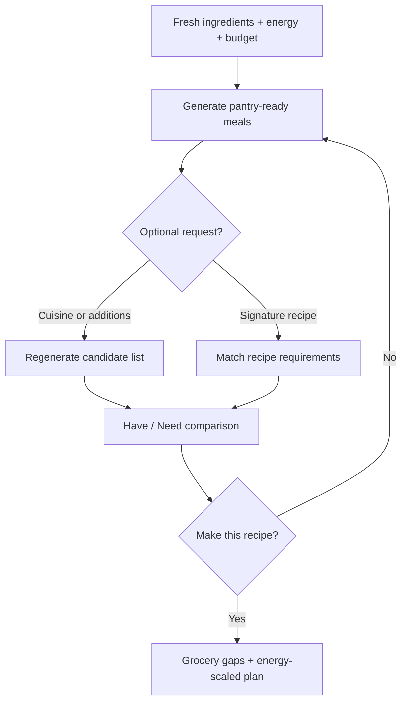

Yes. It makes complete sense—and it connects the planner, inventory, energy model, and Opportunity Engine into one coherent user flow.

The user’s required input remains deliberately small:

* Fresh ingredients available
* Current energy
* Current budget

Everything else is optional intent:

* Cuisine
* Signature recipe
* Additional ingredients
* Specific meal shape
* “Make this recipe”

SNS then recalculates the candidate list whenever that intent changes.

### Energy modifies human capacity

Energy should not merely alter ranking. It changes how much interleaved work SNS may safely schedule.

For example:

| Energy           | Safe attention capacity | Planning behavior                                   |
| ---------------- | ----------------------: | --------------------------------------------------- |
| Normal           |                    100% | Normal overlapping and interleaving                 |
| Low              |                  65–75% | Fewer simultaneous checks; more passive methods     |
| Very low         |                  40–50% | Mostly sequential work; strong equipment assistance |
| Barely breathing |                  20–25% | Assembly, reheating, dump-and-start methods         |

A cook at normal energy might safely manage chicken, mushrooms, and sauce preparation concurrently.

At very low energy, SNS might use the same ingredients but choose:

* pressure cooker or oven;
* fewer pans;
* frozen/precut forms;
* one combined vegetable method;
* bottled sauce;
* more passive time;
* longer total duration with less cognitive load.

So energy scales **attention capacity**, not the physical cooking time. Chicken still takes approximately twelve minutes, but SNS schedules less competing work around it.

### Inventory distinguishes “have” from “need”

For Chinese-style chicken with your example inventory:

| Item           | Status |
| -------------- | ------ |
| Chicken breast | Have   |
| Mushrooms      | Have   |
| Swiss chard    | Have   |
| Asparagus      | Have   |
| Soy sauce      | Need   |
| Garlic         | Need   |

SNS can still recognize the Chinese opportunity, but it should label it honestly:

> Chinese-style chicken and vegetables
> You have 4 of 6 required components.
> Needs: soy sauce and garlic.

That meal may appear only when the user requests Chinese cuisine, allows grocery-needed results, or selects “Make this recipe.”

The grocery list then contains only:

* Soy sauce
* Garlic

Not chicken, mushrooms, Swiss chard, or asparagus, because those are already in stock.

### Candidate behavior

By default, SNS should generate meals from what the household already has.

If the user chooses **Chinese**, the engine reruns and may present:

1. Fully available Chinese-style candidates.
2. Near-match candidates requiring one or two purchases.
3. Candidates requiring more shopping, ranked lower or hidden.

If the user chooses **Make this recipe**, SNS commits to the selected meal and produces:

* ingredients already available;
* ingredients needed;
* grocery list;
* substitutions already in the kitchen;
* energy-appropriate execution plan;
* equipment-aware timeline.

This creates a clean decision flow:

The essential architecture is:

* **Inventory** says what exists.
* **User intent** says what sounds good.
* **CKB/KOs** say what the food requires.
* **Opportunity Engine** says what is possible.
* **Energy model** says how much attention is safely available.
* **Equipment Manager** says where work can happen.
* **Planner** schedules within those limits.
* **Grocery-gap analysis** says what must be purchased.

And your UX rule is strong:

> Do not interrogate the user every evening. Ask only what is fresh, how much energy they have, and the budget. Let optional choices refine the result when the user wants control.

That is not only sensible. It is the correct shape of Stock & Stir.
